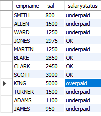

# Using Conditional Logic in a SELECT Statement

## Problem

You want to perform IF-ELSE operations on values in your SELECT statement. For
example, you would like to produce a result set such that if an employee is paid
$2,000 or less, a message of “UNDERPAID” is returned; if an employee is paid $4,000
or more, a message of “OVERPAID” is returned; and if they make somewhere in
between, then “OK” is returned. The result set should look like this:

| ENAME | SAL | STATUS|
| ------|-----|-------|
| SMITH | 800 |UNDERPAID|
|ALLEN  |1600 |UNDERPAID|
|WARD   |1250 |UNDERPAID|
|JONES  |2975 |OK|
|MARTIN |1250 |UNDERPAID|
|BLAKE  |2850 |OK|
|CLARK  |2450 |OK|
|SCOTT  |3000 | OK|
|KING   |5000 |OVERPAID|
|TURNER |1500 | UNDERPAID|
|ADAMS  |1100 |UNDERPAID|
|JAMES  |950  | UNDERPAID|
|FORD   |3000 |OK|
|MILLER |1300 |UNDERPAID|

## Solution

    select empname,sal,
    case when sal <= 2000 then 'UNDERPAID'
    when sal >= 4000 then 'OVERPAID'
    else 'OK'
    end as salarystatus
    from emp;

