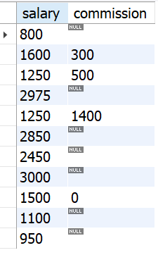

# Referencing an Aliased Column in the WHERE Clause

##  Problem
You have used aliases to provide more meaningful column names for your result set
and would like to exclude some of the rows using the WHERE clause. However, your
attempt to reference alias names in the WHERE clause fails:

    select sal as salary, comm as commission
    from emp
    where salary < 5000

## Solution

    select * from
    (select sal as salary, comm as commission
    from emp) y
    where salary < 5000;

