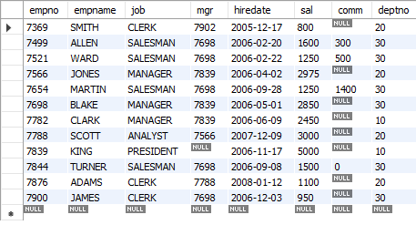
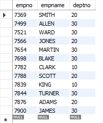

#  Retrieving All Rows and Columns from a Table

##  Problem
You have a table and want to see all of the data in it.

##  Solution

    SELECT * FROM tutorials.emp;

    SELECT empno,empname,deptno FROM tutorials.emp;

