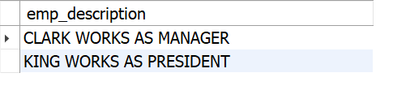

#  Concatenating Column Values

##  Problem
You want to return values in multiple columns as one column. For example, you
would like to produce this result set from a query against the EMP table:

CLARK WORKS AS A MANAGER

KING WORKS AS A PRESIDENT

However, the data that you need to generate this result set comes from two different
columns, the EMPNAME and JOB columns in the EMP table:

    select empname, job
    from emp
    where deptno = 10

| ename  | job       |
|--------|-----------|
| CLARK  | MANAGER   |
| KING   | PRESIDENT |

## Solution

    select concat(empname," WORKS AS ", job) as emp_description
    from emp
    where deptno = 10;

