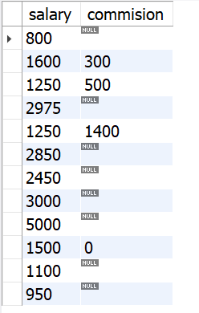

# Providing Meaningful Names for Columns

##  Problem

You would like to change the names of the columns that are returned by your query
so they are more readable and understandable. Consider this query that returns the
salaries and commissions for each employee:
1 select sal,comm
2 from emp
What’s SAL? Is it short for sale? Is it someone’s name? What’s COMM? Is it communi‐
cation? You want the results to have more meaningful labels.

## Solution

    select sal as salary,comm as commision from emp

