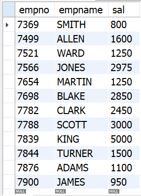

# Retrieving a Subset of Columns from a Table

##  Problem

You have a table and want to see values for specific columns rather than for all the
columns.

## Solution

    select empno, empname, sal from emp;

