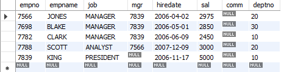
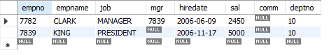

# Retrieving a Subset of Rows from a Table

##  Problem

You have a table and want to see only rows that satisfy a specific condition

## Solution

    select * from  emp  where sal > 2000

    select * from  emp  where deptno = 10

