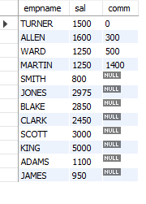

# Dealing with Nulls When Sorting

## Problem

You want to sort results from EMP by COMM, but the field is nullable. You need a
way to specify whether nulls sort last

ENAME| SAL| COMM
-----| ---| ----
TURNER| 1500| 0
ALLEN| 1600| 300
WARD| 1250| 500
MARTIN| 1250| 1400
SMITH| 800
JONES| 2975
JAMES| 950
FORD| 3000
ADAMS| 1100
BLAKE| 2850
CLARK| 2450
SCOTT| 3000
KING| 5000

or whether they sort first:

ENAME| SAL| COMM
----------| ----------| ----------
SMITH| 800
JONES| 2975
CLARK| 2450
BLAKE| 2850
SCOTT| 3000
KING| 5000
JAMES| 950
FORD| 3000
ADAMS| 1100
MARTIN| 1250| 1400
WARD| 1250| 500
ALLEN| 1600| 300
TURNER| 1500| 0

## Solution 

    select empname,sal,comm
    from (
    select empname,sal,comm,
    case when comm is null then 0 else 1 end as is_null  from emp) x
    order by is_null desc,comm;

