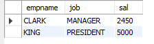

# Returning Query Results in a Specified Order

## Problem

You want to display the names, jobs, and salaries of employees in department 10 in
order based on their salary (from lowest to highest). You want to return the following
result set:
ENAME | JOB | SAL|
------ |----|-----|
CLARK|MANAGER|2450
KING|PRESIDENT|5000

## Solution

    select empname, job, sal 
    from emp 
    where deptno = 10 
    order by sal asc

