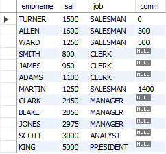

# Sorting on a Data-Dependent Key

## Problem

You want to sort based on some conditional logic. For example, if JOB is SALES‐
MAN, you want to sort on COMM; otherwise, you want to sort by SAL. You want to
return the following result set:
ENAME | SAL | JOB | COMM
---------- | ---------- | --------- | ----------
TURNER | 1500 | SALESMAN | 0
ALLEN | 1600 | SALESMAN | 300
WARD | 1250 | SALESMAN | 500
SMITH | 800 | CLERK
JAMES | 950 | CLERK
ADAMS | 1100 | CLERK
MILLER | 1300 | CLERK
MARTIN | 1250 | SALESMAN | 1400
CLARK | 2450 | MANAGER
BLAKE | 2850 | MANAGER
JONES | 2975 | MANAGER
SCOTT | 3000 | ANALYST
FORD | 3000 | ANALYST
KING | 5000 | PRESIDENT

## Solution 

    select  empname, sal,job,comm  from emp 
    order by case when job = 'SALESMAN' then comm else sal end;

