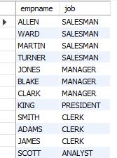

# Sorting by Substrings

## Problem

You want to sort the results of a query by specific parts of a string. For example, you want to return employee names and jobs from table EMP and sort by the last two characters in the JOB field. The result set should look like the following:

| ENAME | JOB |
| ----- | ---- |
ALLEN | SALESMAN
WARD | SALESMAN
MARTIN | SALESMAN
TURNER | SALESMAN
JONES | MANAGER
BLAKE | MANAGER
CLARK | MANAGER
KING | PRESIDENT
SMITH | CLERK
ADAMS | CLERK
JAMES | CLERK
SCOTT | ANALYST

## Solution 

    select empname, job from emp order by substr(job,length(job)-1)

