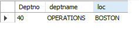

# Retrieving Rows from One Table That Do Not Correspond to Rows in Another

## Problem

You want to find rows that are in one table that do not have a match in another table, for two tables that have common keys. For example, you want to find which depart‐ments have no employees. The result set should be the following:

 DEPTNO | DNAME | LOC
--------| ------| ---
 40     |OPERATIONS | BOSTON
 
Finding the department each employee works in requires an equi-join on DEPTNO from EMP to DEPT. The DEPTNO column represents the common value between tables. Unfortunately, an equi-join will not show you which department has no employees. That’s because by equi-joining EMP and DEPT you are returning all rows that satisfy the join condition. Instead, you want only those rows from DEPT that do not satisfy the join condition.

## Solution 

    select  d.* from dept d  left outer join emp e on (e.deptno = d.deptno) where e.deptno is null;

 