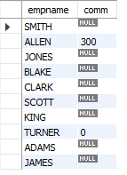

#  Using NULLs in Operations and Comparisons

## Problem

NULL is never equal to or not equal to any value, not even itself, but you want to evaluate values returned by a nullable column like you would evaluate real values. For example, you want to find all employees in EMP whose commission (COMM) is less
than the commission of employee WARD. Employees with a NULL commission should be included as well.

## Solution

    select empname, comm from emp
    where coalesce(comm,0) < (select comm from emp where empname = 'WARD');

