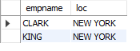

#  Identifying and Avoiding Cartesian Products

## Problem

You want to return the name of each employee in department 10 along with the loca‐
tion of the department. The following query is returning incorrect data:

    select e.empname, d.loc
    from emp e, dept d
    where e.deptno = 10

ENAME|LOC
-----|---
CLARK|NEW YORK
CLARK|DALLAS
CLARK|CHICAGO
CLARK|BOSTON
KING|NEW YORK
KING|DALLAS
KING|CHICAGO
KING|BOSTON

But the correct dataset is :
ENAME | LOC
----- | ---
CLARK | NEW YORK
KING |NEW YORK

## Solution 

    select e.empname, d.loc
    from emp e, dept d
    where e.deptno = 10 and e.deptno = d.deptno;

