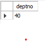

#  Retrieving Values from One Table That Do Not Exist in Another

## Problem
You want to find those values in one table, call it the source table, that do not also exist in some target table. For example, you want to find which departments (if any) in table DEPT do not exist in table EMP. In the example data, DEPTNO 40 from table DEPT does not exist in table EMP, so the result set should be the following:
|DEPTNO |
|------ |
| 40    |

## Solution

    select deptno from dept where deptno not in (select deptno from emp);

    select deptno from dept
    except
    select deptno from emp

