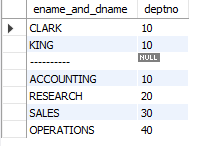

#  Stacking One Rowset atop Another

## Problem

You want to return data stored in more than one table, conceptually stacking one
result set atop the other. The tables do not necessarily have a common key, but their  columns do have the same data types. For example, you want to display the name and department number of the employees in department 10 in table EMP, along with the name and department number of each department in table DEPT. You want the result set to look like the following:

ENAME_AND_DNAME | DEPTNO
--------------- | ----------
CLARK | 10
KING | 10
MILLER | 10

|     |  |    
--------------- | ----------
| ACCOUNTING | 10 |
RESEARCH | 20
SALES | 30
OPERATIONS | 40

## Solution

    select empname as ename_and_dname, deptno
    from emp
    where deptno = 10 
    union all
    select '----------', null
    from t1 union all 
    select deptname, deptno from dept;

